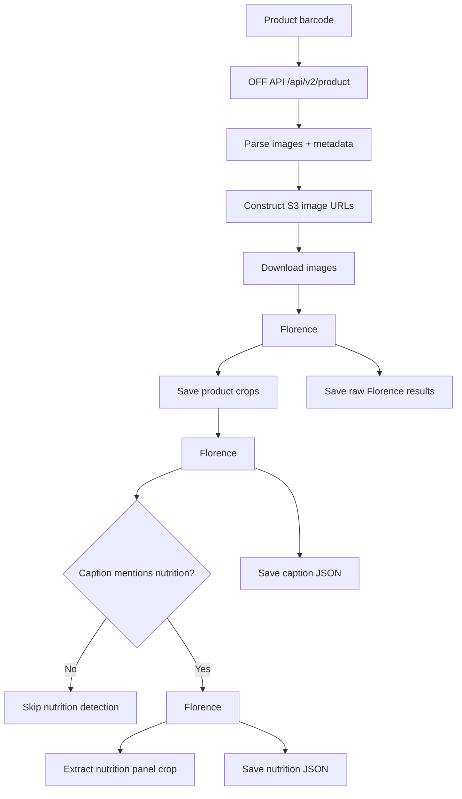

# open-food-facts-florence

Python toolkit that pulls product images from the Open Food Facts API and runs the Florence-2 vision-language model to
locate products, crop them, caption them, and detect nutrition facts panels.

## What this does

- Fetches product metadata and image URLs from Open Food Facts using the product barcode.
- Builds direct S3 URLs for every product image and downloads them.
- Runs Florence-2 phrase grounding to find the product in each image and saves cropped regions.
- Runs detailed captioning on each crop; if captions mention nutrition, runs detection to isolate the nutrition panel.
- Saves originals, crops, nutrition panel crops, and Florence JSON outputs under `images/<product_id>/`.

## How the Open Food Facts API is used

- `get_product_data(barcode)`: calls `https://world.openfoodfacts.org/api/v2/product/{barcode}.json` (barcode padded to
  13 digits) to fetch metadata (title, brand, ingredients, raw product dict).
- `get_images_for_product(barcode)`: inspects `images` and `selected_images` in the API response to collect image ids,
  then constructs direct S3 URLs via `construct_image_url` using the Open Food Facts path format (e.g.,
  `401/235/911/4303`).

## How the Florence-2 pipeline works

- Model: Hugging Face `microsoft/Florence-2-large` (trust_remote_code=True). Device auto-picks MPS on macOS or CPU
  otherwise.
- Phrase grounding: `<CAPTION_TO_PHRASE_GROUNDING>` with the product title (or custom text) to get bounding boxes. Crops
  are filtered by IoU to keep distinct boxes.
- Detailed captioning: `<MORE_DETAILED_CAPTION>` on each crop; only crops whose caption contains nutrition keywords
  proceed to detection.
- Nutrition detection: `<OPEN_VOCABULARY_DETECTION>` with prompt "nutrition facts panel"; keeps the largest plausible
  panel and enforces min area and label checks.
- Persistence: JSON outputs for each step plus cropped PNGs.

## Outputs (under `images/<product_id>/`)

- `original/`: saved originals (`original_0.png`, ...)
- `cropped/`: grounded product crops (`crop_0_0.png`, ...)
- `nutrition_panels/`: extracted nutrition panel crops
- `florence_output/`: raw Florence JSON (`results_0.json`), detailed captions (`caption_0_0.json`), nutrition
  detections (`nutrition_results_0_0.json`)
- `side-by-side/`: side-by-side comparisons of original and cropped images (`comparison_0_0.png`, ...)

## Setup

```bash
python -m venv .venv
source .venv/bin/activate
pip install -r requirements.txt
```

Notes: on macOS this uses MPS if available; otherwise CPU. Large Florence weights will download on first run (cache
under `~/.cache/huggingface`).

## Usage

Run end-to-end from Python:

```python
from batch_off_inference import run_batch_off_inference

result = run_batch_off_inference("0012000130311")
print(result["crops"])
print(result["nutrition_panels"])
```

CLI invocation:

```bash
python batch_off_inference.py 0012000130311
# optional overrides
python batch_off_inference.py 0012000130311 --model-id microsoft/Florence-2-large --text-prompt "Custom product name"
```

### Generate Side-by-Side Comparisons

After running inference, generate visual comparisons of original and cropped images:

```python
from side_by_side_comparison import generate_side_by_side_comparisons

# Generate comparisons with default settings
generate_side_by_side_comparisons("0012000130311")

# Or with custom image width and gap
generate_side_by_side_comparisons("0012000130311", max_width=800, gap=15)
```

CLI invocation:

```bash
python side_by_side_comparison.py 0012000130311
# optional overrides
python side_by_side_comparison.py 0012000130311 --max-width 800 --gap 15
```

Images are saved to `images/<product_id>/side-by-side/`.

## Flow (Mermaid)



## Key functions (quick map)

- `off_api.py`: `_split_barcode_for_path`, `construct_image_url`, `get_product_data`, `get_images_for_product`,
  `zip_images`.
- `batch_off_inference.py`: `setup_model`, `run_phrase_grounding`, `run_detailed_caption`, `detect_nutrition_facts`,
  `extract_and_save_crops`, `extract_nutrition_panels`, `process_product`, `run_batch_off_inference`.
- `side_by_side_comparison.py`: `get_crop_pairs`, `create_side_by_side`, `generate_side_by_side_comparisons`.

## Practical tips

- Barcodes shorter than 13 digits are zero-padded before API calls.
- If OFF rate-limits or times out, the helper waits briefly; consider retrying if images are missing.
- Nutrition panel extraction keeps only the largest plausible panel after filtering tiny/duplicate boxes.

